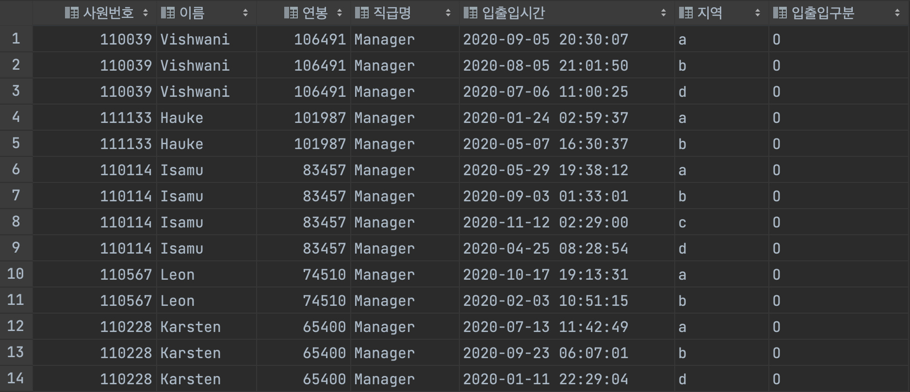
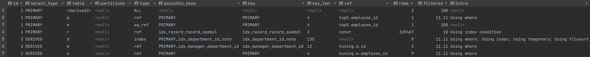

<p align="center">
    
</p>
<p align="center">
  
  
  <a href="https://edu.nextstep.camp/c/R89PYi5H" alt="nextstep atdd">
    
  </a>
  
</p>

<br>

# 인프라공방 샘플 서비스 - 지하철 노선도

<br>

## 🚀 Getting Started

### Install
#### npm 설치
```
cd frontend
npm install
```
> `frontend` 디렉토리에서 수행해야 합니다.

### Usage
#### webpack server 구동
```
npm run dev
```
#### application 구동
```
./gradlew clean build
```
<br>

## 미션

* 미션 진행 후에 아래 질문의 답을 작성하여 PR을 보내주세요.


### 1단계 - 쿼리 최적화

1. 인덱스 설정을 추가하지 않고 아래 요구사항에 대해 1s 이하(M1의 경우 2s)로 반환하도록 쿼리를 작성하세요.

- 활동중인(Active) 부서의 현재 부서관리자 중 연봉 상위 5위안에 드는 사람들이 최근에 각 지역별로 언제 퇴실했는지 조회해보세요. (사원번호, 이름, 연봉, 직급명, 지역, 입출입구분, 입출입시간)

    ```mysql
    select
        top5.employee_id as `사원번호`,
        e.last_name as `이름`,
        top5.annual_income as `연봉`,
        cp.position_name as `직급명`,
        ro.time as `입출입시간`,
        ro.region as `지역`,
        ro.record_symbol as `입출입구분`
    from (
        select
            cm.employee_id,
            cs.annual_income
        from department as d
        inner join (
            select
                m.employee_id,
                m.department_id
            from manager as m
            where now() between m.start_date and m.end_date
        ) as cm  # current manager
            on d.id = cm.department_id
        inner join (
            select
                s.id,
                s.annual_income
            from salary as s
            where now() between s.start_date and s.end_date
        ) as cs # current salary
            on cm.employee_id = cs.id
        where d.note = 'active'
        order by cs.annual_income desc
        limit 5
    ) as top5
    inner join employee as e
        on top5.employee_id = e.id
    inner join (
        select
            p.id,
            p.position_name
        from position as p
        where now() between p.start_date and p.end_date
    ) as cp # current position
        on top5.employee_id = cp.id
    inner join (
        select
            r.employee_id,
            r.time,
            r.record_symbol,
            r.region
        from record as r
        where r.record_symbol = 'O'
    ) as ro # record out
        on top5.employee_id = ro.employee_id;
    ```

    

    ```
   [2022-09-11 02:42:51] 14 rows retrieved starting from 1 in 1 s 671 ms (execution: 1 s 653 ms, fetching: 18 ms)
   ```

    

---

### 2단계 - 인덱스 설계

1. 인덱스 적용해보기 실습을 진행해본 과정을 공유해주세요

---

### 추가 미션

1. 페이징 쿼리를 적용한 API endpoint를 알려주세요
