<p align="center">
    
</p>
<p align="center">
  
  
  <a href="https://edu.nextstep.camp/c/R89PYi5H" alt="nextstep atdd">
    
  </a>
  
</p>

<br>

# 인프라공방 샘플 서비스 - 지하철 노선도

<br>

## 🚀 Getting Started

### Install

#### npm 설치

```
cd frontend
npm install
```

> `frontend` 디렉토리에서 수행해야 합니다.

### Usage

#### webpack server 구동

```
npm run dev
```

#### application 구동

```
./gradlew clean build
```

<br>

## 미션

* 미션 진행 후에 아래 질문의 답을 작성하여 PR을 보내주세요.

### 1단계 - 쿼리 최적화

1. 인덱스 설정을 추가하지 않고 아래 요구사항에 대해 1s 이하(M1의 경우 2s)로 반환하도록 쿼리를 작성하세요.

- 활동중인(Active) 부서의 현재 부서관리자 중 연봉 상위 5위안에 드는 사람들이 최근에 각 지역별로 언제 퇴실했는지 조회해보세요. (사원번호, 이름, 연봉, 직급명, 지역, 입출입구분, 입출입시간)

```sql
select r.employee_id as '사원번호', temp.first_name as '이름', temp.last_name as '성', temp.annual_income as '연봉', 'Manager' as '직급', r.time as '입출입시간', r.region as '지역', 'O' as '입출입구분'
from (select m.employee_id, e.first_name, e.last_name, s.annual_income
      from department d
               inner join manager m on m.department_id = d.id
               inner join position p on p.id = m.employee_id
               inner join salary s on s.id = m.employee_id
               inner join employee e on e.id = m.employee_id
      where d.note = 'active'
        and p.position_name = 'Manager'
        and now() >= m.start_date
        and now() <= m.end_date
        and now() >= p.start_date
        and now() <= p.end_date
        and now() >= s.start_date
        and now() <= s.end_date
      order by s.annual_income desc limit 5)
         as temp
         inner join
     (select employee_id, time, region
      from record
      where record_symbol = 'O')
         as r
     on r.employee_id = temp.employee_id
;
```

> M1 기준 1.6초 대로 나왔습니다.

---

### 2단계 - 인덱스 설계

1. 인덱스 적용해보기 실습을 진행해본 과정을 공유해주세요

> M1 기준

#### Coding as a Hobby 와 같은 결과를 반환하세요.

```sql
select hobby, round(count(1) / (SELECT COUNT(1) FROM programmer) * 100, 1)
from programmer
group by hobby;
```

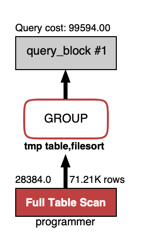

- 인덱스 추가 전
    - 4.3s

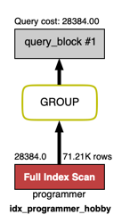

- hobby 인덱스 추가 후
    - 0.4s
    - 더 빠른 방법이 있을까요?

#### 프로그래머별로 해당하는 병원 이름을 반환하세요. (covid.id, hospital.name)

```sql
select p.id as 'programmer id', c.id as 'covid id', h.name as 'hospital name', p.hobby as 'hobby', p.dev_type as 'dev type', p.years_coding as 'years coding'
from programmer p
         left outer join covid c on c.programmer_id = p.id
         inner join hospital h on h.id = c.hospital_id
where p.hobby = 'Yes'
  and (p.dev_type = 'Student' or p.years_coding = '0-2 years');
```

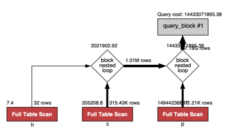

- 인덱스 추가 전
    - 5.0s

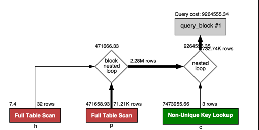

- covid.programmer_id 인덱스 추가 후

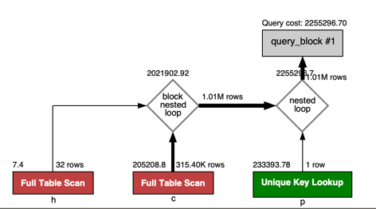

- programmer.id PK 설정 후

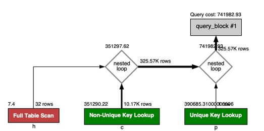

- covid.hospital_id 인덱스 추가 후
    - 0.183s

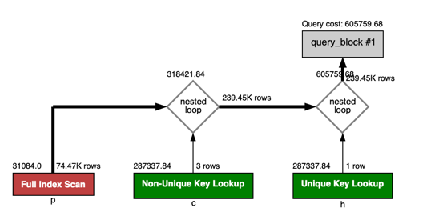

- hospital.id PK 설정 후
    - 0.034s

#### 프로그래밍이 취미인 학생 혹은 주니어(0-2년)들이 다닌 병원 이름을 반환하고 user.id 기준으로 정렬하세요. (covid.id, hospital.name, user.Hobby, user.DevType, user.YearsCoding)

```sql
select p.id as 'programmer id', c.id as 'covid id', h.name as 'hospital name', p.hobby as 'hobby', p.dev_type as 'dev type', p.years_coding as 'years coding'
from programmer p
         left outer join covid c on c.programmer_id = p.id
         inner join hospital h on h.id = c.hospital_id
where p.hobby = 'Yes'
  and (p.dev_type = 'Student' or p.years_coding = '0-2 years');
```

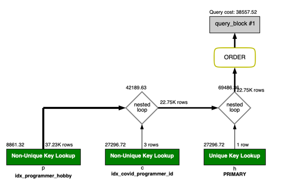

- 인덱스 추가 전
    - 0.054s

#### 서울대병원에 다닌 20대 India 환자들을 병원에 머문 기간별로 집계하세요. (covid.Stay)

```sql
select c.stay, count(1) as 'count'
from programmer p
         left outer join covid c on c.programmer_id = p.id
         left outer join member m on m.id = c.member_id
         inner join hospital h on h.id = c.hospital_id
where p.country = 'India'
  and h.name = '서울대병원'
  and m.age between 20 and 29
group by c.stay;
```

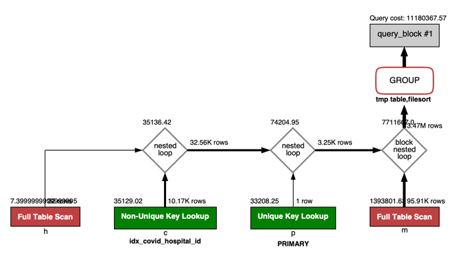

- 인덱스 추가 전
    - 12.146s

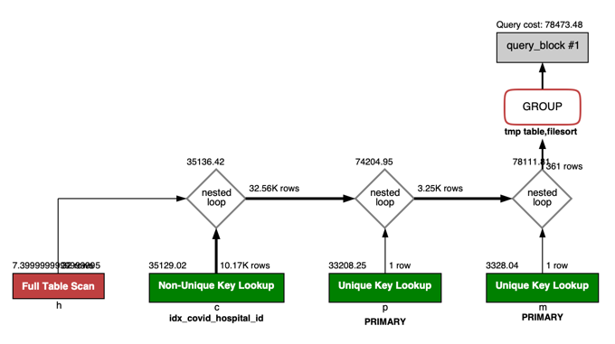

- member id PK 설정 후
    - 1.132s

```sql
select c.stay, count(1) as 'count'
from programmer p
         left outer join covid c
                         on c.programmer_id = p.id
         left outer join (select *
                          from member
                          where age between 20 and 29) m
                         on m.id = c.member_id
         inner join (select *
                     from hospital
                     where name = '서울대병원') h
                    on h.id = c.hospital_id
where p.country = 'India'
group by c.stay
;
```

- query join table 필터 조건으로 변경 후
    - 0.986s

```sql
select c.stay, count(1) as 'count'
from programmer p
         left outer join covid c
                         on c.programmer_id = p.id
         left outer join (select *
                          from member
                          where age between 20 and 29) m
                         on m.id = c.member_id
         inner join (select *
                     from hospital
                     where name = '서울대병원') h
                    on h.id = c.hospital_id
where p.country = 'India'
group by c.stay
;
```

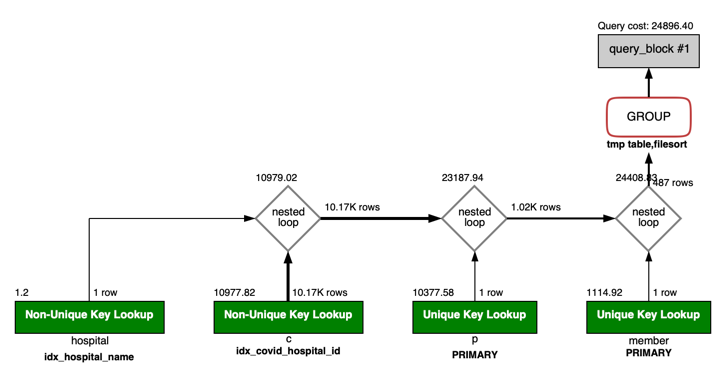

- inner join으로 변경, age 인덱스 추가 후
    - 0.820s

```sql
select c.stay, count(1) as 'count'
from (select *
      from programmer
      where country = 'India') p
         inner join covid c on c.programmer_id = p.id
         inner join (select id
                     from member
                     where age between 20 and 29) m on m.id = c.member_id
         inner join (select id
                     from hospital
                     where name = '서울대병원') h on h.id = c.hospital_id
group by c.stay
;
```

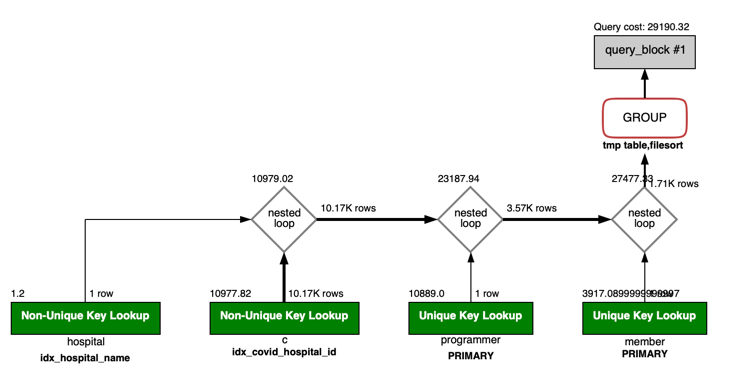

- programmer 모수 줄이기, country 인덱스 추가 후
    - 0.181s

#### 서울대병원에 다닌 30대 환자들을 운동 횟수별로 집계하세요. (user.Exercise)

```sql
select p.exercise, count(1) as 'count'
from (select id, exercise
      from programmer) p
         inner join (select programmer_id, member_id, hospital_id
                     from covid) c on c.programmer_id = p.id
         inner join (select id
                     from member
                     where age between 30 and 39) m on m.id = c.member_id
         inner join (select id
                     from hospital
                     where name = '서울대병원') h on h.id = c.hospital_id
group by p.exercise
order by null;
```

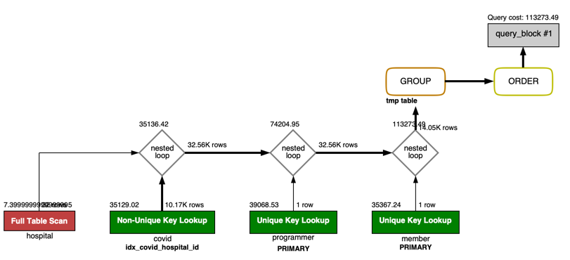

- 인덱스 추가 전
  - 0.242s

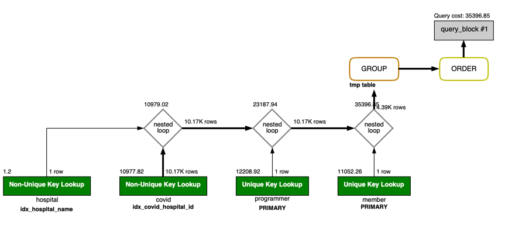

- hospital name 인덱스 추가 후
  - 0.185s

---

### 추가 미션

1. 페이징 쿼리를 적용한 API endpoint를 알려주세요
