<p align="center">
    
</p>
<p align="center">
  
  
  <a href="https://edu.nextstep.camp/c/R89PYi5H" alt="nextstep atdd">
    
  </a>
  
</p>

<br>

# 인프라공방 샘플 서비스 - 지하철 노선도

<br>

## 🚀 Getting Started

### Install
#### npm 설치
```
cd frontend
npm install
```
> `frontend` 디렉토리에서 수행해야 합니다.

### Usage
#### webpack server 구동
```
npm run dev
```
#### application 구동
```
./gradlew clean build
```
<br>

## 미션

* 미션 진행 후에 아래 질문의 답을 작성하여 PR을 보내주세요.


### 1단계 - 쿼리 최적화

1. 인덱스 설정을 추가하지 않고 아래 요구사항에 대해 200ms 이하(M1의 경우 2s)로 반환하도록 쿼리를 작성하세요.

- 활동중인(Active) 부서의 현재 부서관리자 중 연봉 상위 5위안에 드는 사람들이 최근에 각 지역별로 언제 퇴실했는지 조회해보세요. (사원번호, 이름, 연봉, 직급명, 지역, 입출입구분, 입출입시간)

```sql
## v6. (2022.10.10) 0.191sec
EXPLAIN;
SELECT
    top_m.employee_id as '사원번호',
    top_m.last_name as '이름',
    top_m.annual_income as '연봉',
    top_m.position_name as '직급명',
    r.region as '지역',
    r.record_symbol as '입출입구분',
    r.time as '입출입시간'
FROM (
         SELECT am.employee_id, e.last_name, s.annual_income, p.position_name
         FROM (
                  SELECT employee_id
                  FROM manager m
                           LEFT JOIN department d on d.id = m.department_id
                  WHERE end_date >= current_date()
                    and d.note = 'active'
              ) AS am
                  INNER JOIN (
             SELECT id, annual_income, end_date
             FROM salary
         ) AS s on am.employee_id = s.id AND s.end_date >= current_date()
                  INNER JOIN position p on p.id = am.employee_id AND p.end_date >= current_date()
                  INNER JOIN employee e on e.id = am.employee_id
         ORDER BY annual_income desc
         limit 5
     ) AS top_m
         INNER JOIN record r ON r.employee_id = top_m.employee_id AND r.record_symbol = 'O';

```

---
### 2단계 - 인덱스 설계

1. 인덱스 적용해보기 실습을 진행해본 과정을 공유해주세요

<br>

#### 요구조건 
- 주어진 데이터셋을 활용하여 아래 조회 결과를 100ms 이하로 반환
  - M1의 경우엔 시간 제약사항을 달성하기 어렵습니다. 200ms를 기준으로 해보시고 어렵다면, 일단 리뷰요청 부탁드려요

<br>

#### 1) Coding as a Hobby 와 같은 결과를 반환하세요. 

- before : 0.211sec
  - 
  - 
- after : 0.035sec
  - programmer > hobby 에 index 추가 
  - 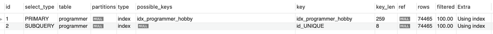
  - 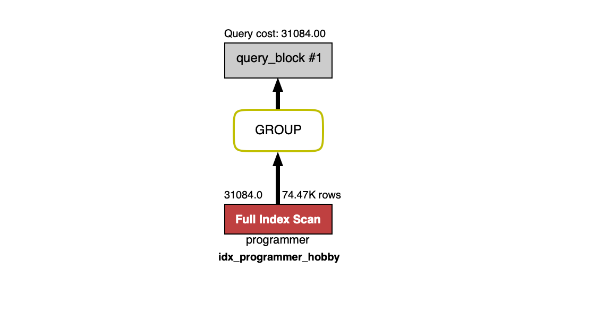

```sql
EXPLAIN
SELECT 
	hobby,
	TRUNCATE(count(1) / (SELECT count(1) FROM programmer) * 100, 1)
FROM programmer
GROUP BY hobby;

```

<br>

#### 2) 프로그래머별로 해당하는 병원 이름을 반환하세요. (covid.id, hospital.name)

- before : 0.0040sec
  - 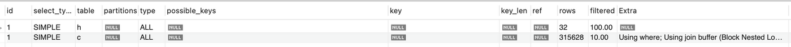
  - 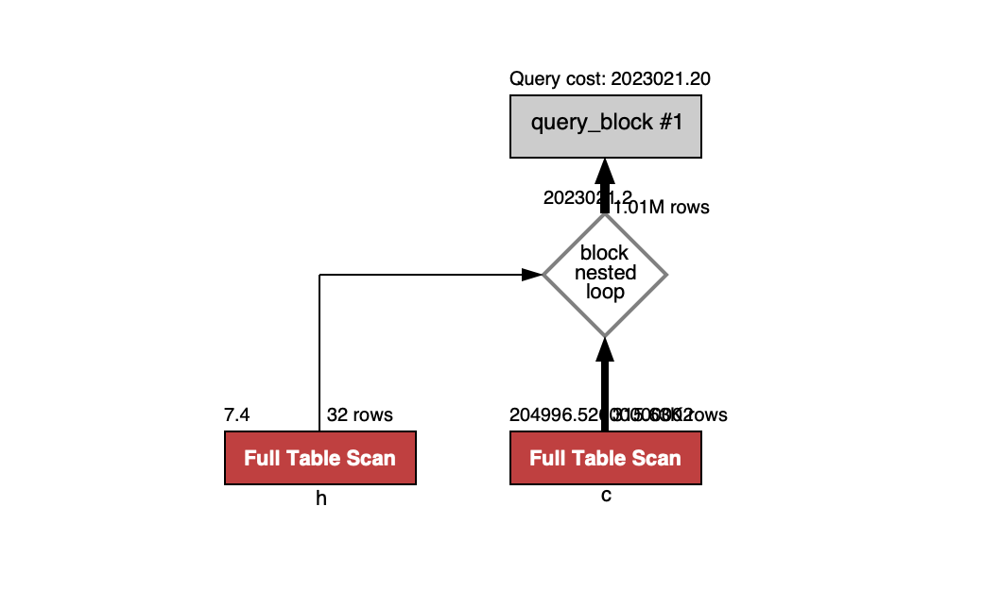
- after : 0.0015sec
  - hospital > id에 pk, nn, uq 적용
  - covid > id에 pk, nn, uq 적용
  - covid > id + hospital_id index 적용
  - 
  - 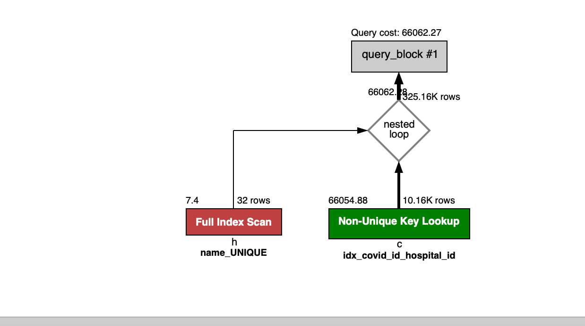

```sql
EXPLAIN;
SELECT 
	c.id,
    h.name
FROM hospital h
INNER JOIN covid c ON c.hospital_id = h.id;

```

<br>


#### 3) 프로그래밍이 취미인 학생 혹은 주니어(0-2년)들이 다닌 병원 이름을 반환하고 user.id 기준으로 정렬하세요. (covid.id, hospital.name, user.Hobby, user.DevType, user.YearsCoding)

- before : 0.616sec
  - 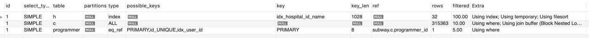
  - 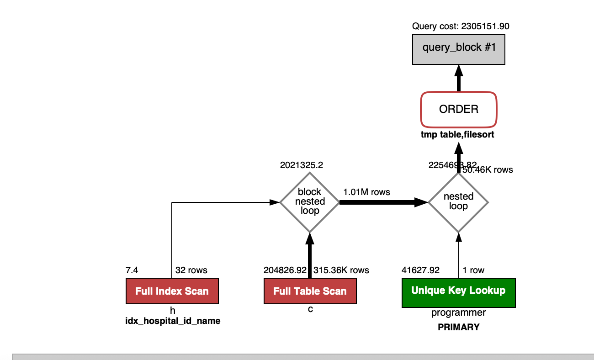
- after : 0.117sec
  - programmer > id 에 pk, nn, uq 추가 
  - hospital > id 에 pk, nn, uq 추가
  - covid > id 에 pk, nn, uq 추가
  - 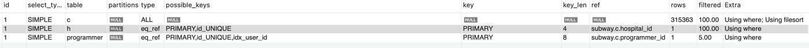
  - 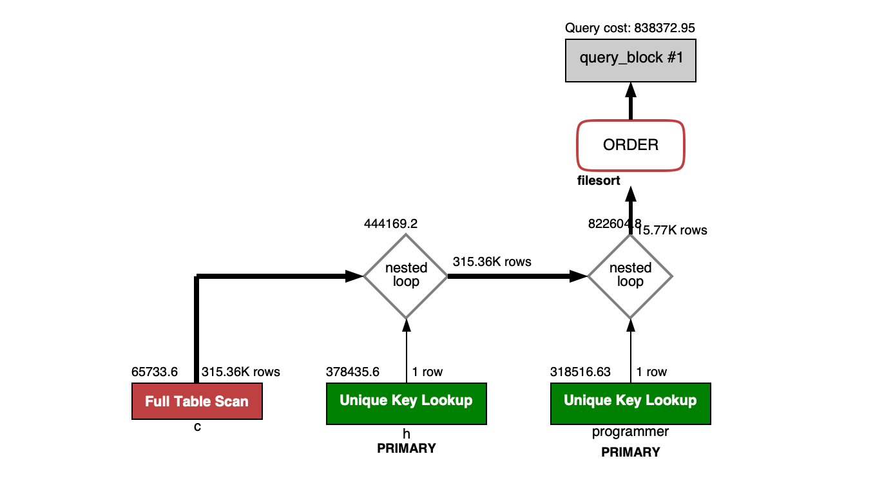

```sql
EXPLAIN;
SELECT 
	c.programmer_id,
	h.name
FROM hospital h
INNER JOIN covid c ON c.hospital_id = h.id
INNER JOIN (SELECT id FROM programmer WHERE hobby = 'Yes' AND (dev_type LIKE 'Student%' OR years_coding_prof = '0-2 years')) AS p ON p.id = c.programmer_id
ORDER BY c.programmer_id;

```

<br>

#### 4) 서울대병원에 다닌 20대 India 환자들을 병원에 머문 기간별로 집계하세요. (covid.Stay)

- before : 0.147sec
  - 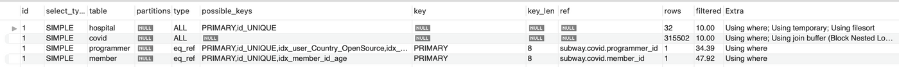
  - 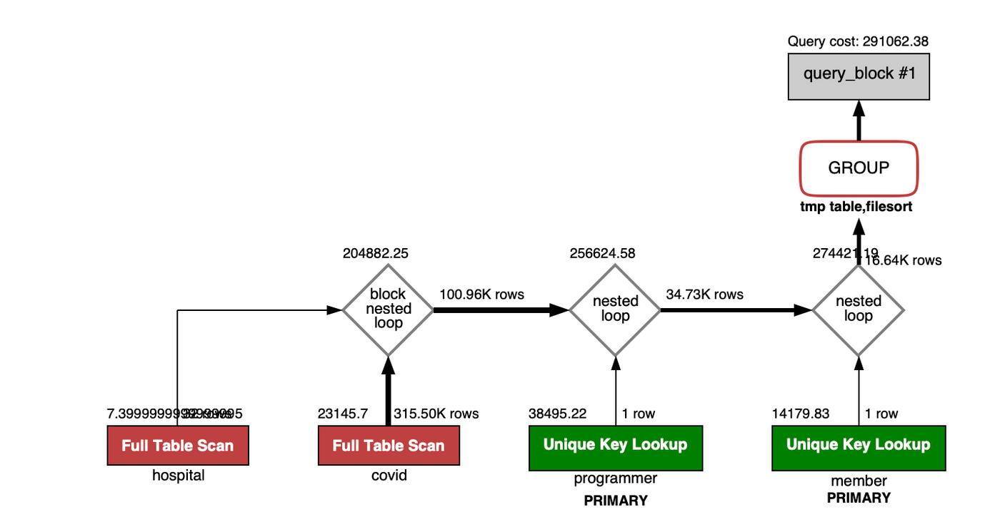
- after : 0.024sec
  - hospital > id에 pk, nn, uq 속성 추가
  - hospital > name unique 속성 추가
  - hospital > id + name index 추가
  - covid > id에 pk, nn, uq 속성 추가
  - covid > id + member_id + hospital_id + programmer_id + stay index 추가
  - programmer : id 에 pk, nn, uq 추가
  - member: id 에 pk, nn, uq 추가
  - 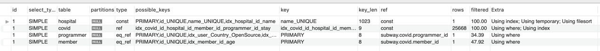
  - 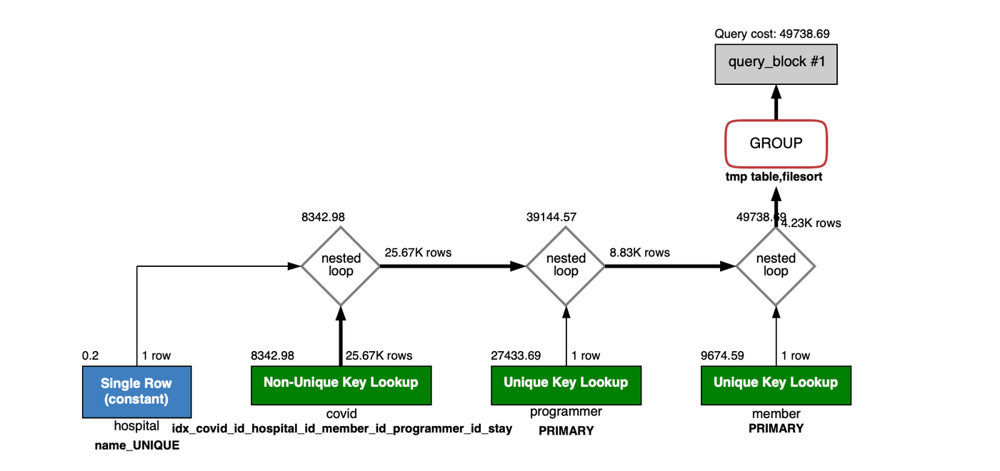

```sql
EXPLAIN;
SELECT
	stay,
	count(1) as cnt
FROM (SELECT id FROM hospital WHERE name = '서울대병원') AS h
INNER JOIN (SELECT hospital_id, member_id, programmer_id, stay FROM covid) as c ON c.hospital_id = h.id
INNER JOIN (SELECT id FROM member WHERE age between 20 and 29) AS m ON c.member_id = m.id
INNER JOIN (SELECT id FROM programmer WHERE country = 'India') AS p ON c.programmer_id = p.id
GROUP BY stay;

```

<br>

#### 5) 서울대병원에 다닌 30대 환자들을 운동 횟수별로 집계하세요. (user.Exercise)

- before 
  - 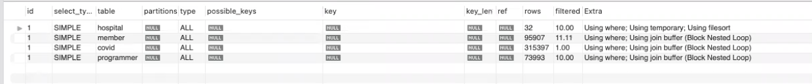
  - 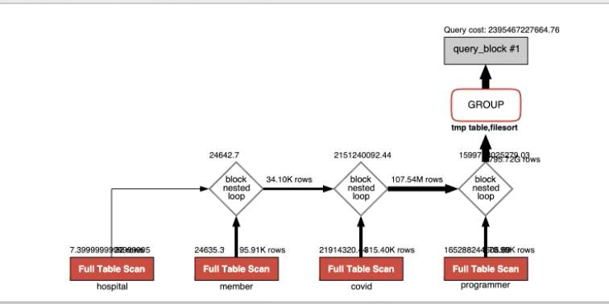
- after : 
  - hospital > id에 pk, nn, uq 적용
  - hospital > name 속성에 uq 적용
  - covid > id에 pk, nn, uq 적용
  - covid > id + hospital_id 를 index로 잡아줌
  - member > id에 pk, nn, uq 적용
  - member > id + age index 적용
  - programmer > id에 pk, nn, uq 적용
  - 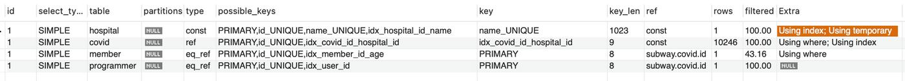
  - 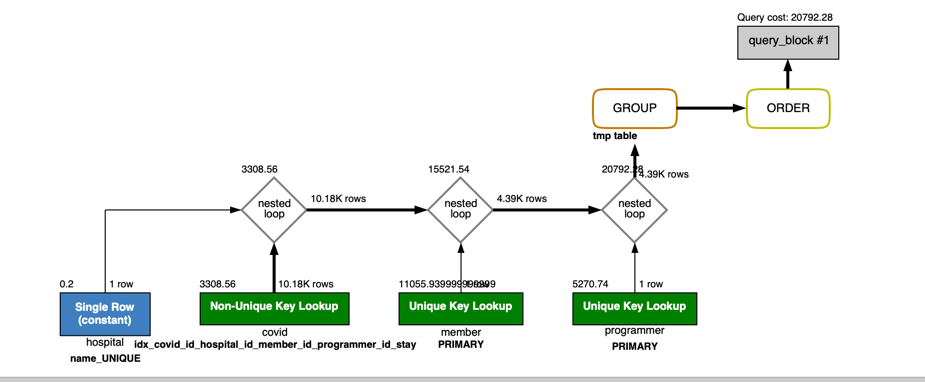


```sql
EXPLAIN;
SELECT 
	exercise,
    count(A.id)
FROM (SELECT id FROM hospital where name = '서울대병원') AS B
INNER JOIN (SELECT id, hospital_id FROM covid) AS C ON C.hospital_id = B.id 
INNER JOIN (SELECT id FROM member where age between 30 and 39) AS M ON M.id = C.id 
INNER JOIN (SELECT id, exercise FROM programmer) AS A ON A.id = C.id 
GROUP BY exercise
ORDER BY null;

```


---

### 추가 미션

1. 페이징 쿼리를 적용한 API endpoint를 알려주세요
