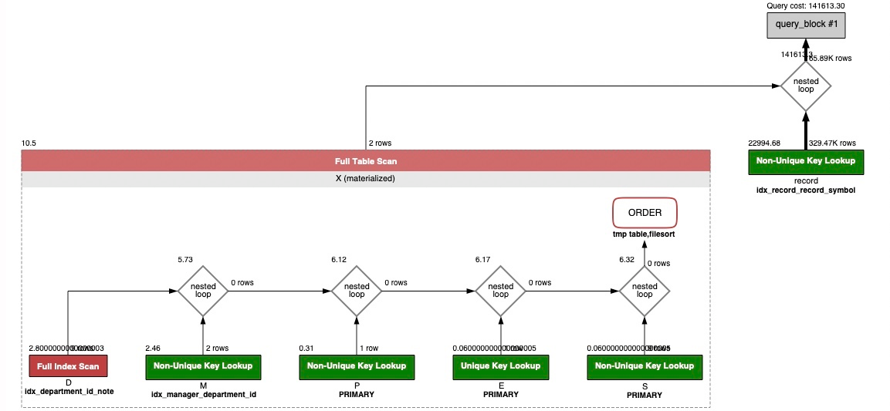
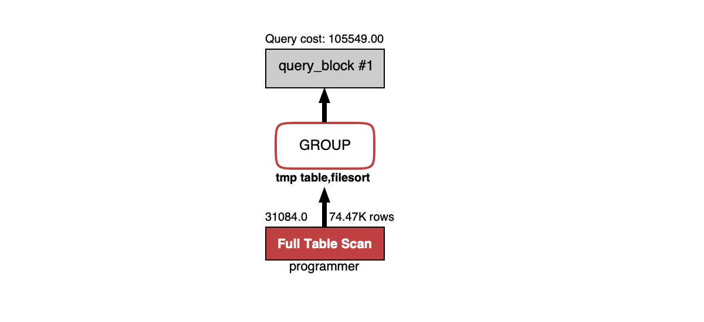

<p align="center">
    
</p>
<p align="center">
  
  
  <a href="https://edu.nextstep.camp/c/R89PYi5H" alt="nextstep atdd">
    
  </a>
  
</p>

<br>

# 인프라공방 샘플 서비스 - 지하철 노선도

<br>

## 🚀 Getting Started

### Install
#### npm 설치
```
cd frontend
npm install
```
> `frontend` 디렉토리에서 수행해야 합니다.

### Usage
#### webpack server 구동
```
npm run dev
```
#### application 구동
```
./gradlew clean build
```
<br>

## 미션

* 미션 진행 후에 아래 질문의 답을 작성하여 PR을 보내주세요.


### 1단계 - 쿼리 최적화

1. 인덱스 설정을 추가하지 않고 아래 요구사항에 대해 1s 이하(M1의 경우 2s)로 반환하도록 쿼리를 작성하세요.

- 활동중인(Active) 부서의 현재 부서관리자 중 연봉 상위 5위안에 드는 사람들이 최근에 각 지역별로 언제 퇴실했는지 조회해보세요.    
  (사원번호, 이름, 연봉, 직급명, 지역, 입출입구분, 입출입시간)
    ```sql
    SELECT X.사원번호
         , X.이름
         , X.연봉
         , X.직급명
         , R.time          입출입시간
         , R.region        지역
         , R.record_symbol 입출입구분
    FROM (
             SELECT D.id            부서ID
                  , M.employee_id   사원번호
                  , E.last_name     이름
                  , P.position_name 직급명
                  , S.annual_income 연봉
             FROM tuning.department D
                      JOIN tuning.manager M ON D.id = M.department_id
                      JOIN tuning.employee E ON M.employee_id = E.id
                      JOIN tuning.position P ON E.id = P.id
                      JOIN tuning.salary S ON S.id = M.employee_id
                 AND D.note = 'active' /* Active(active) 상태인 부서 */
                 AND NOW() BETWEEN M.start_date AND M.end_date /* 현재매니저 */
                 AND NOW() BETWEEN P.start_date AND P.end_date /* 현재매니저 */
                 AND NOW() BETWEEN S.start_date AND S.end_date   
             ORDER BY S.annual_income desc
                 LIMIT 0,5
         ) X
             JOIN
         (
             SELECT employee_id, time, region, record_symbol
             FROM tuning.record
             WHERE record_symbol = 'O' /* 퇴실(O) */
         ) R
         ON R.employee_id = X.사원번호
    ```

- 실행계획 



- 실행시간 : 0.182sec

    - mysql에서 문자열 대소문자 상관없이 검색된다고 해서 그냥 'active'로만 비교함.   
      Active 상태인 부서를 조히할 때 `AND D.note = 'active' OR 'Active'`로 조회해보니       
      0.182sec -> 0.170sec로 소폭 줄어들었으나 큰 차이 없는 것 같음
---

### 2단계 - 인덱스 설계

1. 인덱스 적용해보기 실습을 진행해본 과정을 공유해주세요

---

### 추가 미션

1. 페이징 쿼리를 적용한 API endpoint를 알려주세요
