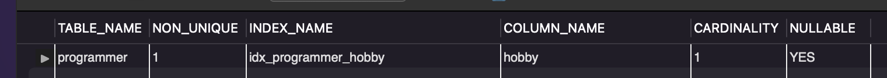
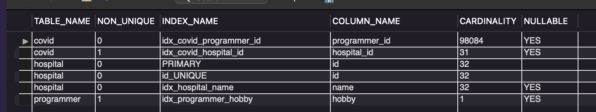
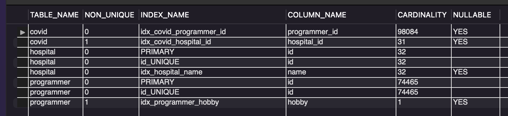
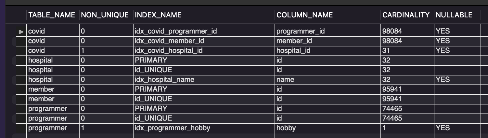

<p align="center">
    
</p>
<p align="center">
  
  
  <a href="https://edu.nextstep.camp/c/R89PYi5H" alt="nextstep atdd">
    
  </a>
  
</p>

<br>

# 인프라공방 샘플 서비스 - 지하철 노선도

<br>

## 🚀 Getting Started

### Install
#### npm 설치
```
cd frontend
npm install
```
> `frontend` 디렉토리에서 수행해야 합니다.

### Usage
#### webpack server 구동
```
npm run dev
```
#### application 구동
```
./gradlew clean build
```
<br>

## 미션

* 미션 진행 후에 아래 질문의 답을 작성하여 PR을 보내주세요.


### 1단계 - 쿼리 최적화

1. 인덱스 설정을 추가하지 않고 아래 요구사항에 대해 200ms 이하(M1의 경우 2s)로 반환하도록 쿼리를 작성하세요.

- 활동중인(Active) 부서의 현재 부서관리자 중 연봉 상위 5위안에 드는 사람들이 최근에 각 지역별로 언제 퇴실했는지 조회해보세요. (사원번호, 이름, 연봉, 직급명, 지역, 입출입구분, 입출입시간)

```sql
USE tuning;

SELECT 
	sub.employee_id,
	sub.last_name,
	sub.annual_income, 
	sub.position_name, 
	r.time, 
	r.region, 
	r.record_symbol
FROM record AS r 
INNER JOIN (
	SELECT employee_id, e.last_name, s.annual_income, p.position_name
	FROM salary s
	INNER JOIN manager AS m 
		ON m.employee_id = s.id
	INNER JOIN department AS d 
		ON m.department_id = d.id
	INNER JOIN employee AS e 
		ON e.id = m.employee_id
	INNER JOIN position AS p 
		ON p.id = s.id
	WHERE CURRENT_DATE() < s.end_date
		AND CURRENT_DATE() < m.end_date
		AND CURRENT_DATE() < p.end_date
		AND LOWER(d.note) = 'active'
		AND p.position_name = 'Manager'
	ORDER BY s.annual_income DESC
	LIMIT 5
) sub ON sub.employee_id = r.employee_id
WHERE r.record_symbol = 'O'
GROUP BY sub.employee_id, sub.annual_income, r.time, r.region
ORDER BY sub.annual_income DESC
```

---

### 2단계 - 인덱스 설계

#### Coding as a Hobby 와 같은 결과를 반환하세요.



```sql
USE subway;

SELECT 
	hobby, 
	COUNT(hobby) AS `count`,
	COUNT(hobby) / (SELECT COUNT(hobby) FROM programmer) * 100 as `percent`
FROM programmer 
GROUP BY hobby
ORDER BY NULL;
```

#### 프로그래머별로 해당하는 병원 이름을 반환하세요. (covid.id, hospital.name)



```sql
USE subway;

SELECT c.programmer_id, h.name
FROM covid AS c
INNER JOIN hospital AS h 
	ON c.hospital_id = h.id
WHERE c.programmer_id IS NOT NULL
GROUP BY c.programmer_id, h.name
ORDER BY NULL;
```

#### 프로그래밍이 취미인 학생 혹은 주니어(0-2년)들이 다닌 병원 이름을 반환하고 user.id 기준으로 정렬하세요. (covid.id, hospital.name, user.Hobby, user.DevType, user.YearsCoding)



```sql
USE subway;

SELECT c.id, p.id, h.name, p.hobby, p.dev_type, p.years_coding
FROM programmer AS p
INNER JOIN covid AS c
	ON c.programmer_id = p.id
INNER JOIN hospital AS h
	ON h.id = c.hospital_id
WHERE p.hobby = 'Yes' 
	AND (dev_type LIKE 'Student%' OR years_coding_prof = '0-2 years')
ORDER BY p.id;
```

#### 서울대병원에 다닌 20대 India 환자들을 병원에 머문 기간별로 집계하세요. (covid.Stay)



```sql
USE subway;

SELECT c.stay, COUNT(m.id)
FROM covid AS c
INNER JOIN hospital AS h 
	ON h.id = c.hospital_id AND h.name = '서울대병원'
INNER JOIN member AS m 
	ON m.id = c.member_id AND m.age BETWEEN '20' AND '29'
INNER JOIN programmer AS p 
	ON p.id = c.programmer_id AND p.country = 'India'
WHERE c.member_id IS NOT NULL 
	AND c.programmer_id IS NOT NULL
GROUP BY c.stay
ORDER BY NULL;
```

---

### 추가 미션

1. 페이징 쿼리를 적용한 API endpoint를 알려주세요
